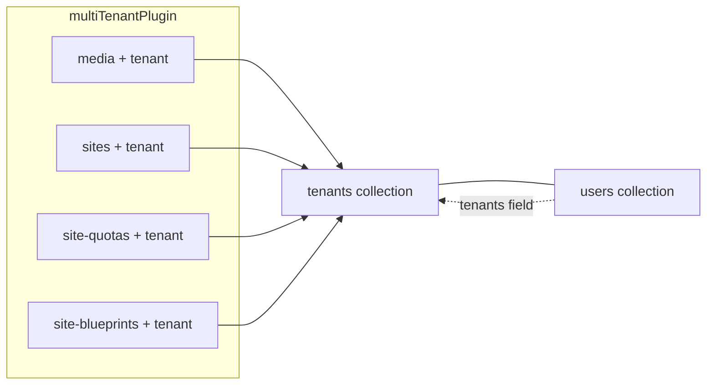

# Admin：Collection、Global 与侧栏菜单（现状对齐 + 站群目标路线图）

## 现状与文档偏差（摘要）

早期版本若按「完整站群后台」描述侧栏与集合，会与**当前克隆**不一致。以下以仓库内代码为准；**§四 起**为 **[规划中]** 的目标信息架构，供 affiliate 站群分阶段落地。

- **配置唯一事实来源**：[src/payload.config.ts](src/payload.config.ts)（`buildConfig` 内 `collections`、`plugins`；当前无 `globals` 数组）。
- **已注册业务 collections**：仅 **`tenants`、`users`、`media`**（同文件 `collections: [Tenants, Users, Media]`）。
- **多租户**：[src/payload.config.ts](src/payload.config.ts) 内 `multiTenantPlugin` 的 `collections` **目前仅含 `media`**；超管绕过见 [src/utilities/superAdmin.ts](src/utilities/superAdmin.ts)。类型上 `User` 含 **`tenants`** 等由插件注入的字段；**尚无** `teamLead`、团队管理员角色或 Users 侧栏 `hidden` 规则。
- **MCP**：在 **`mcpPlugin({ ... })`** 中配置（**无**独立 `src/payload-mcp-plugin.ts`）。暴露集合 **`tenants`、`users`、`media`**（与 `mcpCollectionSlugs`、[src/utilities/mcpSuperAdminAccess.ts](src/utilities/mcpSuperAdminAccess.ts) 一致）；侧栏另有插件注入的 **`payload-mcp-api-keys`**。
- **Tenants 权限**：[src/collections/Tenants.ts](src/collections/Tenants.ts)：**读取** 仍为任意已登录用户；**创建 / 更新 / 删除** 已限制为 **`userHasAllTenantAccess`（超管）**。
- **Users / Media**：[src/collections/Users.ts](src/collections/Users.ts)、[src/collections/Media.ts](src/collections/Media.ts) 已配置 **`admin.group`（`group`）与根级 `labels`**（与 §4.3 一致）；侧栏 `hidden` 仍为 **[规划中]**。
- **Globals**：未注册业务 Global（生成的 [src/payload-types.ts](src/payload-types.ts) 中 `globals: {}`）。
- **缺失引用**：**无** [docs/batch-site-management-purpose.md](docs/batch-site-management-purpose.md)（可后续新增）。**FinanceDashboard、TeamLeadDashboard、HomeDashboardWithoutCollectionGrid、`beforeNavLinks` 等自定义 Admin 组件** 当前仓库 **不存在**，属 **[规划中] / 阶段 D**。

---

## 北极星与范围

- **目标产品形态**：大规模 **affiliate 站群管理**（多租户、多站点、联盟与 Offer、追踪与结算、内容与自动化）。
- **当前代码定位**：**Payload 3 + Cloudflare（D1 / R2）+ Next.js** 基座，已接 **`@payloadcms/plugin-multi-tenant`**（部分集合）、**`@payloadcms/plugin-mcp`**、**R2 存储**。
- **本文档结构**：**§一～§三** = 现状；**§四～§七** = 目标 IA 与落地顺序（实现后 `admin.group`、集合文件路径会随代码更新）。

---

## 一、现状 — Collections（slug → 说明）

| slug | 说明 |
|------|------|
| `tenants` | [src/collections/Tenants.ts](src/collections/Tenants.ts)；`name`、`slug`、`domain` |
| `site-blueprints` | [src/collections/SiteBlueprints.ts](src/collections/SiteBlueprints.ts)；蓝图 JSON；**仅超管**侧栏与 CRUD |
| `sites` | [src/collections/Sites.ts](src/collections/Sites.ts)；站群站点（域名、状态、可选 blueprint / operators）；多租户 |
| `users` | [src/collections/Users.ts](src/collections/Users.ts)；`auth`，`roles`: `user` / `super-admin` |
| `media` | [src/collections/Media.ts](src/collections/Media.ts)；上传至 R2；`useTenantAccess: false` |
| `site-quotas` | [src/collections/SiteQuotas.ts](src/collections/SiteQuotas.ts)；按站点配额；**仅超管**侧栏与 CRUD |
| `payload-mcp-api-keys` | 由 `@payloadcms/plugin-mcp` 注入；权限在 [src/payload.config.ts](src/payload.config.ts) 的 `mcpPlugin` 中配置 |

**注册顺序（现状）**：[src/payload.config.ts](src/payload.config.ts) — `Tenants` → `SiteBlueprints` → `Sites` → `Users` → `Media` → `SiteQuotas`。

**内置集合**（Payload 系统用，一般不改侧栏分组）：如 `payload-migrations`、`payload-preferences` 等，见 [src/payload-types.ts](src/payload-types.ts)。

---

## 二、现状 — Globals

**无**业务 Global 注册。若后续增加白标、LLM 配置、配额/佣金规则等，在 [src/payload.config.ts](src/payload.config.ts) 增加 `globals` 并在本节与 §四 同步更新。

---

## 三、现状 — 多租户与权限要点

- **`media`**：在 `multiTenantPlugin.collections` 中声明，文档带租户维度。
- **超管**：`userHasAllTenantAccess` — `super-admin` 角色和/或 `PAYLOAD_SUPER_ADMIN_EMAILS`（见 [src/utilities/superAdmin.ts](src/utilities/superAdmin.ts)）。
- **`users.roles`**：非超管无法在 Admin 中把他人设为 `super-admin`（`beforeChange` 于 [src/collections/Users.ts](src/collections/Users.ts)）。
- **阶段 A**：`tenants` / `users` / `media` 侧栏分组见 [src/constants/adminGroups.ts](src/constants/adminGroups.ts)。
- **阶段 B（已落地）**：`sites`、`site-quotas`、`site-blueprints` 已注册；`multiTenantPlugin.collections` 含 `sites`、`site-quotas`、`site-blueprints`（`media` 仍为 `useTenantAccess: false`）；MCP 已暴露 `sites`；迁移 [src/migrations/20260420_151119.ts](src/migrations/20260420_151119.ts)。
- **待办**：随 §五 C–D 继续扩展 `multiTenantPlugin` / MCP。

---

## 四、[规划中] 目标 IA — Collections、Globals 与侧栏分组

实现后建议统一 `admin.group`（下列中文组名为推荐方案，避免「运营管控」等过粗分组）。**下列 slug 对应的 `src/collections/*.ts` / `src/globals/*.ts` 多数尚未在本仓库创建**，落地时以 §五 阶段为准。

### 4.1 目标 Collections（slug → admin.group → 标签备注）

| slug | admin.group | labels（单 / 复） | 备注 |
|------|-------------|-------------------|------|
| `tenants` | 平台与租户 | 租户 / 租户 | 建议仅超管可写 |
| `audit-logs` | 平台与租户 | 审计日志 / 审计日志 | 仅超管侧栏可见 |
| `site-blueprints` | 平台与租户 | 站点蓝图 / 站点蓝图 | 仅超管侧栏可见 |
| `site-quotas` | 平台与租户 | 站点配额 / 站点配额 | 仅超管侧栏可见 |
| `sites` | 站点 | 站点 / 站点 | |
| `users` | 成员与权限 | 用户 / 用户 | 可设非超管侧栏 hidden |
| `media` | 素材 | 媒体 / 媒体库 | 已存在 |
| `categories` | 素材 | 分类 / 分类 | |
| `keywords` | 关键词研究 | 关键词 / 关键词 | |
| `posts` | 内容创作 | 文章 / 文章 | |
| `workflow-jobs` | 任务与自动化 | 工作流任务 / 工作流任务 | |
| `rankings` | 数据监控 | 排名快照 / 排名快照 | |
| `click-events` | 数据监控 | 点击事件 / 点击事件 | |
| `commissions` | 财务与佣金 | 佣金记录 / 佣金记录 | |
| `employee-performance` | 团队绩效 | 员工绩效 / 员工绩效 | |
| `social-platforms` | 社交媒体 | 社交平台 / 社交平台 | 仅超管侧栏可见 |
| `social-accounts` | 社交媒体 | 社交账号 / 社交账号 | |
| `knowledge-base` | 运营支持 | 知识库文档 / 知识库 | |
| `affiliate-networks` | 商业合作 | 联盟 / 联盟 | |
| `offers` | 商业合作 | Offer / Offer | |
| `payload-mcp-api-keys` | MCP | （插件生成） | 已存在 |

**目标注册顺序（实现后）**：`Tenants` → `Sites` → `Users` → `Categories` → `Media` → `Posts` → `Keywords` → `AuditLogs` → `WorkflowJobs` → `SiteQuotas` → `ClickEvents` → `Rankings` → `Commissions` → `EmployeePerformance` → `SiteBlueprints` → `SocialPlatforms` → `SocialAccounts` → `KnowledgeBase` → `AffiliateNetworks` → `Offers`。

**目标多租户作用域**：`sites`、`posts`、`media`、`categories`、`keywords`、`offers`、`knowledge-base`、`social-accounts`、`site-quotas`、`click-events`、`rankings`、`workflow-jobs`、`affiliate-networks`、`site-blueprints`、`social-platforms`、`commissions`、`employee-performance` 等应列入 `multiTenantPlugin.collections`（以最终实现为准）。

### 4.2 目标 Globals

| slug | admin.group | label |
|------|-------------|-------|
| `admin-branding` | 系统设置 | 白标与外观 |
| `llm-prompts` | 系统设置 | LLM 配置 |
| `prompt-library` | 系统设置 | 提示词库 |
| `quota-rules` | 系统设置 | 配额规则 |
| `commission-rules` | 财务与佣金 | 佣金规则 |

### 4.3 目标侧栏分组汇总

- **平台与租户**：`tenants`, `audit-logs`, `site-blueprints`, `site-quotas`
- **站点**：`sites`
- **成员与权限**：`users`
- **素材**：`media`, `categories`
- **关键词研究**：`keywords`
- **内容创作**：`posts`
- **任务与自动化**：`workflow-jobs`
- **数据监控**：`rankings`, `click-events`
- **财务与佣金**：`commissions`；**`commission-rules`**
- **团队绩效**：`employee-performance`
- **社交媒体**：`social-platforms`, `social-accounts`
- **运营支持**：`knowledge-base`
- **商业合作**：`affiliate-networks`, `offers`
- **系统设置**：`admin-branding`, `llm-prompts`, `prompt-library`, `quota-rules`
- **MCP**：`payload-mcp-api-keys`
- **[规划中]** **团队管理**：自定义 Admin 视图或 `beforeNavLinks`，与「成员与权限」分工

---

## 五、分阶段落地（A–D）

| 阶段 | 内容 |
|------|------|
| **A — Admin 可维护性与安全** | 为现有 `tenants` / `users` / `media` 补 `admin.group`、`labels`（按需）；收紧 `tenants` 等 `access`；扩展 `multiTenantPlugin.collections`；按需扩展 `mcpPlugin.collections` 与 `mcpCollectionSlugs` |
| **B — 站群核心数据模型** | 新增 `sites` 及站点与租户/用户关系；`site-quotas`、`site-blueprints` 等 |
| **C — Affiliate 闭环** | `affiliate-networks`、`offers`、追踪（`click-events` 等）、`commissions` 与 Globals 佣金/配额规则 |
| **D — 内容与自动化** | `posts`、`categories`、`keywords`、`workflow-jobs`、LLM Globals；**页面**（扩展 `postType` 或新建 `pages`）；自定义 Dashboard、`teamLead` / 团队管理视图、`usersAccess`（实现时新建，例如 `src/access/usersAccess.ts`；当前仓库无此目录） |

**说明**：在对应 collection/global **创建后**再改其 `admin.group` 字符串，与 §4.3 保持一致；侧栏组内排序依赖 Payload 版本，必要时再用自定义导航。

---

## 六、可选文档

产品北极星（批量站点管理）可另写 [docs/batch-site-management-purpose.md](docs/batch-site-management-purpose.md)。集合与菜单以本文档 **§一～§四** 为准。

---

## 七、[规划中] 业务域对照与查漏

以下为 **目标对齐** 用检查清单；**不表示**当前仓库已实现。

### 7.1 首页

- 财务 / 运营看板：**[规划中]**，在 [src/payload.config.ts](src/payload.config.ts) 的 `admin.components` 中扩展。
- 通知公告：可选 Global `announcements` 或 collection。

### 7.2 网站

- `sites`、设计/蓝图 `site-blueprints`、`keywords`、`posts`、**页面**（选型待定）、`media`、`categories`。
- **Offer** 主数据在 `offers`；内容与 Offer 关联策略（relationship / 块 / 列表筛选）待 PRD。
- **`tenants`** 为根实体，需在运营 IA 中显式说明。

### 7.3 运营

- `rankings`、`click-events`、`site-quotas`、`workflow-jobs`、`audit-logs`；Globals：`llm-prompts`、`prompt-library`、`quota-rules`。

### 7.4 社媒

- `social-platforms`、`social-accounts`。

### 7.5 团队

- `users` 扩展 **`teamLead`**、团队角色；**[规划中]** `usersAccess` 等与站点范围一致（实现时新建访问控制模块，当前无 `src/access/`）；`commission-rules`、用户分成字段、`commissions`、`employee-performance`。

### 7.6 商务 / 财务 / 知识库 / 系统

- 商务：`affiliate-networks`、`offers`。
- 财务：明细 `commissions` + 汇总 Dashboard 或自定义视图；规则 `commission-rules`。
- 知识库：`knowledge-base`（对内）；与对外 `posts` 区分。
- 系统：MCP Keys、`admin-branding`、审计、租户、LLM/配额 Globals。

### 7.7 待拍板与缺口

- `site-quotas` 归属文案；`commission-rules` 与团队入口关系；`employee-performance` 汇报视图（团队 vs 财务）。
- 通知公告；财务聚合视图；**页面** 选型；内容与 Offer 统一策略。

### 7.8 内容域小结

- 对外内容主要在 **`posts`**；**页面** 待选型。
- **可推广 Offer** 主数据在 **`offers`**，避免重复主数据。
- **知识库** 对内、**内容创作** 对外。

---

**执行本文档时**：以 [src/payload.config.ts](src/payload.config.ts) 为注册入口；MCP 仅改 **`mcpPlugin`** 块；勿引用不存在的 `payload-mcp-plugin.ts`。
